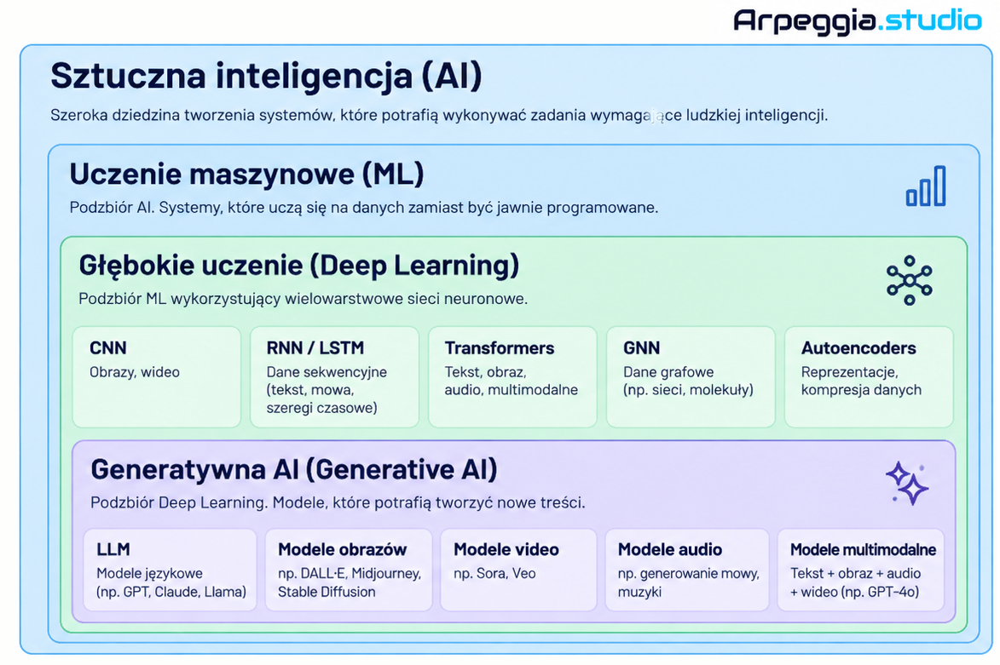
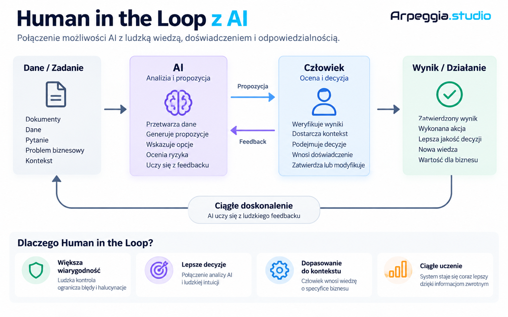
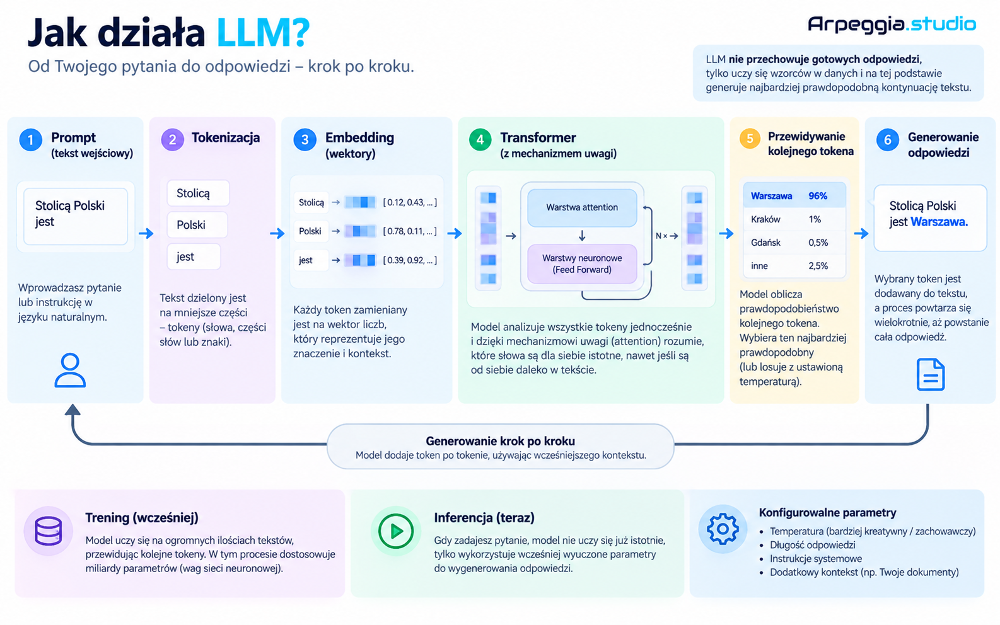
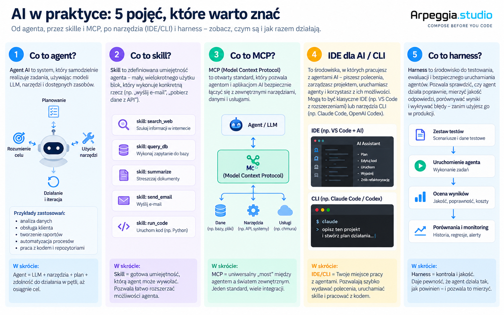

# Wprowadzenie do AI

Ten materiał jest krótkim wprowadzeniem do sztucznej inteligencji oraz najważniejszych pojęć związanych z nowoczesnymi systemami AI.

Celem materiału jest uporządkowanie podstawowych pojęć i pokazanie zależności pomiędzy takimi obszarami jak:

* Artificial Intelligence
* Machine Learning
* Deep Learning
* Generative AI
* Large Language Models
* agenci AI
* skills
* MCP
* AI IDE / CLI
* harness
* Human in the Loop

Materiały mają charakter wprowadzający i są przedstawione głównie w formie infografik.

## Infografiki

### 1. AI, Machine Learning, Deep Learning i Generative AI

### 2. Human in the Loop

### 3. Jak działa LLM?

### 4. Agent, Skill, MCP, IDE / CLI i Harness

> Materiał: wprowadzenie do AI.

