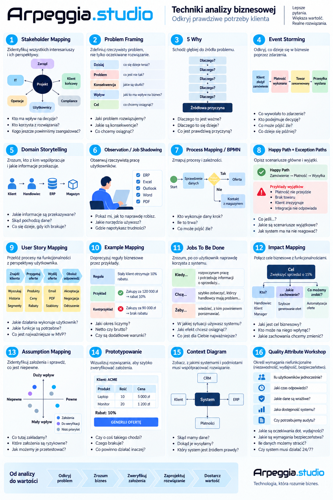

#Techniki analizy bizesowej





**gherkin**

```
Scenario: Anulowanie nowego zamówienia  

Given zamówienie ma status "NOWE"  
When użytkownik anuluje zamówienie  
Then status zamówienia zmienia się na "ANULOWANE"

```
